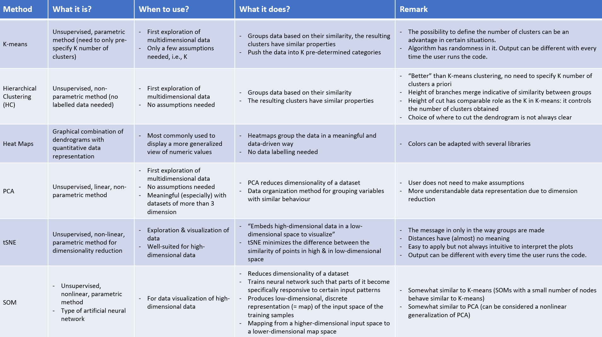

# Overview

One could apply the following methods to the data. 

- Kmeans clustering 
- Hierarchical Clustering (HC) & Heat Maps 
- t-Distributed Stochastic Neighbor Embedding (tSNE) 
- Prinicpal Component Analysis (PCA) 
- Self-Organizing Maps (SOM) 

<br><br>

# Initial Situation
We are a consulting company, which offers consulting around the topic Machine Learning. In the present order a wine dealer from South Africa engaged us to examine his collected data. The wine merchant sells the wine mainly to hotels, restaurants but also to private customers. The wine dealer has a showroom in which he presents a selection of his wines to his customers. Based on his many years of experience, he evaluates the quality of each wine in order to advise his customers in the best possible way.
Therefore, he has a database in which the quality of the wines, but also other characteristics are stored. These include, for example, the pH value, acidity, alcohol content, density, etc. A total of 12 predictors are included. 
Our task now is to form certain clusters in the available data, so that the wine dealer can differentiate his wines not only according to grape varieties, countries of origin and growing regions, but also according to other criteria.
One idea that he has expressed is that he can make an initial classification of the quality of the wine on the basis of the alcohol content or the pH value.


# Setup
## Preparation

Install package checkpoint prior to running to following code in your shell:
- install.packages(checkpoint)
- checkpoint("2019-09-20")

## Load packages

```{r install_packages, message=FALSE, warning=FALSE}

library(Rtsne) # library for TSNE
library(corrplot) # it is a graphical display of a correlation matrix, confidence interval 
library(gplots)  # for making own color code (e.g. for heatmap representation)
library(kohonen) # functions to train self-organising maps (SOMs)
library(plot3D) # functions for viewing 2-D & 3-D data, including perspective plots, slice plots, scatter plots, etc.
library(factoextra)  # more complexe library than standard R library; all methods for distance & linkage available
library(dendextend) # can be used to represent the data in “fan” diagrams
library(ape) # can be used to represent the data in “fan” diagrams
library(RColorBrewer)  # for making own color code and show different shades of colors (e.g. for heatmap representation)
library(rmarkdown) # convert R Markdown documents into a variety of formats
library(DataExplorer) # automated data exploration process for analytic tasks and predictive modeling 
library(tidyverse)  # library for SOM
library(kohonen)  # library for SOM
library(checkpoint) # package to solve the problem of package reproducibility in R
```


# Method selection
We created an overview and comparison about the covered methods within the course "Applied Machine Learning and Predictive Modelling II":

```{r}

```

A zoomable version of the overview can be found [here](https://www.evernote.com/l/Ai9WPKBaEfFEzqgLvlABkPvsZA7qA0CgPjI/).

<br>

Furthermore one can you use this decision support tool to get the suitable methods for the predominant problem: <br> https://mod.rapidminer.com/#app


# Data 
## Preparation
```{r preparation}
# clean the memory
rm(list = ls(all = TRUE)) 

# load data
df <- read.csv("winequality-red.csv")
saveRDS(df, "data/winequality-red.Rds")

# count the missing values (NA) in the data frame
sum(is.na(df))

# check if the columns are numeric
sapply(df, is.numeric)

# scale the data
df_scaled <- scale(df)
class(df_scaled)  # is now a matrix

as_tibble(df_scaled)

```


## Exploration

```{r exploration}
glimpse(df)
# View(df)
summary(df)

# create_report(df)  
```

<br><br>


# k-Means-Clustering

# 

One can use this Shiny widget to explore different variable settings combined with k number of clusters. 

```{r eval=FALSE, message=FALSE, warning=FALSE, include=FALSE}
options(shiny.deprecation.messages=FALSE)
library(rmdexamples)
kmeans_cluster(df)
```

We continue to do a proper analysis in the next section. 

<br><br>

## Caluclate k-means-clustering and Show Metrics

**Available metrics in the returend k-Means object**  

* **withinss:**  Vector of within-cluster sum of squares, one component per cluster.
* **tot.withinss:** Total within-cluster sum of squares, i.e. sum(withinss). 
* **size:** The number of points in each cluster.
* **totss:** The total sum of squares.
* **centers:** A matrix of cluster centres.
* **cluster:** A vector of integers (from 1:k) indicating the cluster to which each point is allocated
* **betweenss:** The between-cluster sum of squares, i.e. totss-tot.withinss.
* **iter:** The number of (outer) iterations.
* **ifault:** integer: indicator of a possible algorithm problem – for experts.
```{r eval=FALSE, include=FALSE}

# Run K-means for k=2
k <- 2 #defining to work with two clusters
km.out <- kmeans(df_scaled, k,nstart =50)
plot(df_scaled, col =(km.out$cluster+1), main ="K-Means Clustering", xlab ="", ylab ="", pch =20, cex =2)

# Check the outcome
km.out
km.out$withinss
cat("withinss =", km.out$tot.withinss)

# Find best value for k 
wss <- 0 # intialise
wss_dif <- 0
number_of_clusters_tested <- 20
for (i in 1:number_of_clusters_tested){
  km.out <- kmeans(df_scaled,i,nstart =50)
  wss[i] <- km.out$tot.withinss
  if(i > 1){ # only enter condition for two clusters and higher
    wss_dif[i-1] <- wss[i-1]-wss[i] # take difference from previous "total within-cluster sum of squares" and current one.
  }
    
}

plot(1:number_of_clusters_tested, wss, type="b", xlab="Number of Clusters",ylab="Total within-cluster sum of squares")
plot(2:number_of_clusters_tested, wss_dif, type="b", xlab="Number of Clusters",ylab="Difference between Total within-cluster sum of squares")
```

**Interpretation: **

*First plot: K-means Clustering with k=2 is not very useful. This plot is only useful if you have a dataset with only two dimensions.

*Second plot: With increasing number of clusters the total within cluster sum of squares decreases always. To decide which k is the best, look for the ellbow in the plot. In this plot there is no clear ellbow visible. Therefore we go for k = 2.

*Third plot: This plot shows the differnce between the i-th and the i-1th value of the total within-cluster sum of squares. This plot should be viewed with caution as it compares the sum of squares to the previous (k-1) sum of squares. An alternative would be to subtract the mean from every sum of squares.


# Hierarchical Clustering (HC)

## Caluclate Hierarchical Clustering and Show Metrics

**Available metrics in the returend HC object**  

* **labels:** labels for each of the objects being clustered.
* **method:** the cluster method that has been used.
* **dist.method:** the distance that has been used to create d (only returned if the distance object has a "method" attribute).
* **call:** the call which produced the result.
* **order:** a vector giving the permutation of the original observations suitable for plotting, in the sense that a cluster plot using this ordering and matrix merge will not have crossings of the branches.
* **height:** a set of n-1 real values (non-decreasing for ultrametric trees). The clustering height: that is, the value of the criterion associated with the clustering method for the particular agglomeration.
* **merge:** an n-1 by 2 matrix. Row i of merge describes the merging of clusters at step i of the clustering. If an element j in the row is negative, then observation -j was merged at this stage. If j is positive then the merge was with the cluster formed at the (earlier) stage j of the algorithm. Thus negative entries in merge indicate agglomerations of singletons, and positive entries indicate agglomerations of non-singletons.

```{r eval=FALSE, include=FALSE}

# Calculate distances between data (default method = euclidean):
distances <- dist(df_scaled, method = "euclidean")

# Compute hierarchical clustering based in distances calculated above:
hc <- hclust(distances)

# Computes dendrogram graphical representation:
dend <- as.dendrogram(hc)

# Graphical representation
plot(dend, main = "Dendogram plot")

# Alternative, standard output representation (can be useful for ctrl+find specific things in big trees)
# str(dend)  # computionally very expensive, takes about 2 minutes


# Transpose data:
df_transposed <- t(df_scaled)


# Calculate distances between data (default method = euclidean):
distances_t <- dist(df_transposed, method = "euclidean")

# Compute hierarchical clustering based in distances calculated above:
hc_t <- hclust(distances_t)

# Computes dendrogram graphical representation:
dend_t <- as.dendrogram(hc_t)

# Graphical representation
plot(dend_t, main = "Transposed Dendogram plot")

# Alternative, standard output representation (can be useful for ctrl+find specific things in big trees)
str(dend_t)


# Use a specific linkage or distance methode in hc clustering

# Find more information about distances and which one to choose: https://www.datanovia.com/en/lessons/clustering-distance-measures/
# Possible distance methods: "euclidean", "maximum", "manhattan","canberra","binary", "minkowski"

# Find more information about linkage method and which one to choose: https://www.datanovia.com/en/lessons/agglomerative-hierarchical-clustering/#linkage
# Possible linkage methods: "ward.D", "ward.D2", "single", "complete","average", "mcquitty", "median","centroid"

# Compute hierarchical clustering with euclidean distance and complete method:
hc <- hclust(dist(df_scaled, method = "euclidean"),method="complete")
plot(hc, main = "Dendogram Plot with Euclidean distance, method complete")

# Missing correlation-based methods (spearman, kendall): using library(factoextra) for these methods
# Compute the dissimilarity matrix with different distance types: "euclidean", "manhattan", "pearson", "spearman", "kendall"
res.dist <- get_dist(df_scaled, method = "kendall")

# Visualize the dissimilarity matrix
fviz_dist(res.dist, lab_size = 8)

# Compute hierarchical clustering with different linkage types:"single", "complete", "average", "centroid", "ward.D", "ward.D2"
res.hc <- hclust(res.dist, method = "ward")

# Visualize the tree
fviz_dend(res.hc)

# Or simply
plot(res.hc, main = "HC with ward linkage type")


# Create heatmap with scaled data
heatmap(df_scaled)

# Make your own color code brewer.pal(n, name)
# n Number of different colors in the palette, minimum 3, maximum depending on palette
# name Blues BuGn BuPu GnBu Greens Greys Oranges OrRd PuBu PuBuGn PuRd Purples RdPu Reds YlGn YlGnBu YlOrBr YlOrRd
palette <- colorRampPalette(brewer.pal(9, "YlGnBu"))

# Row- and column-wise clustering, with wished linkage and distance method; hc1 with regular data and hc2 with transposed data:
hc1 <- hclust(as.dist(1-cor(t(df_scaled), method="kendall")), method="ward.D2")
hc2 <- hclust(as.dist(1-cor(df_scaled, method="spearman")), method="single")

# Plot heatmap: Heatmap.2 (included in the Gplots Library) allows to define linkage & distance methods for heatmap representaton
heatmap.2(df_scaled, Rowv=as.dendrogram(hc1), Colv=as.dendrogram(hc2), col=palette,scale="row", density.info="none", trace="none")

```

**Interpretation: **

*Dendogram plot: This plot is not very useful. It contains a lot of overloaded information. The height of the cut in the dendogram has comparable role as the number of K in K-means clustering: it controls the number of clusters obtained.

*Transposed Dendogram plot: This plot is way more useful and contains information to work with. The lower the altitude of a branch is, the closer the predictors are to each other. For example fixed.acidity and citric.acid have the lowest branch hight which means that these two predictors are closely related to each other.  

*Dissimilarity Matrix: There isn't a lot of similarity in the dataset. The diagonal members are defined as zero. This means that zero is the measure of dissimilarity between an element and itself.

*Heatmaps: High values are red, low values are yellow in the plot. The main pattern to look for is a rectangular area of about the same color. That suggests a group of rows that is correlated for the corresponding group of columns.


# tSNE
## Caluclate tSNE and Show Metrics

### The wine dealer would like to know if there is a possible grouping for the different wines. This would allow him to organise his wines in an appropriate fashion.

**Available metrics in the returend TSNE object**  

https://www.analyticsvidhya.com/blog/2017/01/t-sne-implementation-r-python/

* **dims:**  the number of dimensions the data should be reduced to
* **perplexity:** it can be interpreted as a smooth measure of the effective number of neighbours (usuallly between 5 and 50) 
* **max_iter:** Maximum iterations
* **Theta:** speed/accuracy trade-off,increase for speed but less accuracy (default 0.5)


```{r}
# define parameter
dims <- "tbd"
# ...
```

```{r}
# the dateframe needed to be re-defined as dataframe for the code to work properly
df_scaled_df <- as.data.frame(df_scaled)

# datapoint later in the plot: data_label<-as.factor(rownames(data))
# Run tSNE:

# we need to remove duplicates

tsne <- Rtsne(df_scaled_df[!duplicated(df_scaled_df), ], dims = 2,
            perplexity=50, verbose=TRUE,
            max_iter = 500)

```

```{r}
## 1 ## This first section concerning colouring allows us to colour scaled numeric columns
#Create a function to generate a continuous color palette
rbPal <- colorRampPalette(c('red','yellow'))

#This adds a column of color values
# creates 10 colour buckets based on quality
df_scaled_df$Col_qual <- rbPal(8)[as.numeric(cut(df_scaled_df$quality,breaks = 10))]
# creates 10 colour buckets based on ph
df_scaled_df$Col_pH <- rbPal(8)[as.numeric(cut((df_scaled_df$pH),breaks = 10))]

## 2 ## We can choose colouring to be df_scaled_df$Col or e.g. df$quality
# Plot data and labels:
plot(tsne$Y, col=df_scaled_df$Col_qual, pch=16, main = "tSNE coloured by quality")
plot(tsne$Y, col=df_scaled_df$Col_pH, pch=16, main = "tSNE coloured by pH")

str(tsne)
```


**Interpretation: **

* Could not find any meaningful patterns or a sensible groups
* The plots were coloured by pH and quality but could not establish clear relationships
* The visual categorisation does not seem to be useful for this dataset

### The tSNE could not find any meaningful groupings for the wines. 


# Prinicpal Component Analysis (PCA)

## Caluclate PCA and Show Metrics

**Available metrics in the returend PCA object**  

* **sdev:**  standard deviation of the principal components
* **rotation:** rotation matrix shows the principal components of the loadings (variables). 
* **center:** mean of each variable before scaling and computing PCA
* **scale:** applied scale
* **x:** x matrix shows the principal components of the scores (of the observation)

```{r}

# Compute PCA.
# scale=TRUE to scale the variables to have standard deviation = 1
pca_out = prcomp(df, scale=TRUE)

# Show available metrics computed by PCA: 
names(pca_out)

# Access metrics computed by PCA
pca_out$sdev    # show sdev
pca_out$center  # show mean
pca_out$scale   # show scale

# Rotation matrix provides the principal component of the loadings.
dim(pca_out$rotation) # p*p matrix whereas p is the number of variables (loadings)
pca_out$rotation

# x matrix provides the principal component of the scores.
dim(pca_out$x) # n * p matrix whereas n is the number of observations and p is the number of principal componentes
# pca_out$x # not executed due to size of the matrix
```

## Create Biplot

**Interpretation: **
  
* The features quality and aclcohol are similar
* free.sulfur dioxide and total.sulfur dioxide point into the opposite direction as quality. So it can be expected that sulfur content of a wine is an indicator for bad quality. -> not true according to plot further below
* fixed.acitiy and pH point in the opposite direction. pH value is a metric to measure the acidity. A low pH value indicates high acidity whereas a high pH value indicate a low acidity (alkaline). So the result in the biplot is conclusive
```{r}

# Create Biplot 
# scale=0 ensures that the arrows are scaled to represent the loadings; 
# other values for scale give slightly different biplots with different interpretations.
biplot(pca_out,scale=0)


# Create Biplot with reduced sample to get a better overview

# Sample Data
set.seed(2)
sample_1=sample(1:nrow(df), nrow(df)/3) # sample a third of the data for training data
df_reduced=df[sample_1,]

# Calculate PCA on reduced dataset
pca_out_reduced = prcomp(df_reduced, scale=TRUE)

# Create Biplot on reduced dataset
biplot(pca_out_reduced,scale=0)
# create_report(df)

```


## Interpretation of Biplot
```{r}
plot(df$quality,df$alcohol)
plot(df$fixed.acidity,df$pH)
plot(df$quality,df$total.sulfur.dioxide)
plot(df$chlorides,df$density)

```


## Show variance explained by certain Principal Components

**summary() on a prcomp object**
Summary shows the standard deviation, proportion of variance and cumulative proportion of variance of each principal component
  
**Result:** 6 Principal Components explain more than 80% of the variance in the data.
```{r}
# screeplot shows the variance of each prinicipal component
screeplot(pca_out)

# Alternative:
# It's more usueful to have the proportion (%) of variance of each principal component

# Numeric values about proportion of variance can be retrieved with the summary function
summary(pca_out)

# Compute the proportion of variance explained by each principal component 
# Calculation: variance explained by each principal component / total variance explained by all principal components)

# Calculate variance of prinicipal components
pca_out_var <- pca_out$sdev^2

# calculate proportion of variance for each principal component
pve <- pca_out_var/sum(pca_out_var)
pve

# plots
plot(pve, main="Proporation of Variance per PC",xlab="Principal Component",ylab="Proportion of Variance Explained",ylim=c(0,1),type='b')
plot(cumsum(pve),main="Cumulative Proporation of Variance per PC",xlab="PrincipalComponent",ylab="Cumulative Proportion of Variance
Explained",ylim=c(0,1),type='b')

```


# Calculate Self-Organizing Maps (SOMs) and Show Metrics

**Purpose: Data visualization of high-dimensional data.**
How: Mapping from a higher-dimensional input space to a lower-dimensional map space with competitive learning. 

```{r}
# preprocess data for model
df_unique <- unique(df)  # remove duplicates, here 200 data rows
glimpse(df_unique)

data <-
  as.matrix(scale(df_unique[, 1:11]))  # scale: mean = 0, sd = 1

# show feature names
dimnames(data)[2]  # label successfully removed

# For plotting evaluation against colorcode
# category (~ classification solution)
row_label <- as.factor(rownames(data))
qualities <- as.character(df$quality)

data_train_matrix <- as.matrix(scale(data))

```

Removed wine quality label and transformed to scaled matrix which serves as input for the SOM model.

General tipps regarding usage of SOMs:

- Hyperparameter tuning: try & error 
- Codes plot shows feature importance per neuron  
- Mapping plot shows logical cluster which could contain several labels/classes  


```{r}
# set up model
set.seed(22)  # for reproducible results

# get heuristic number of neurons for the following grid
# use this heuristic from Alexander Maier https://www.researchgate.net/post/How_many_nodes_for_self-organizing_maps

neurons <- 5*sqrt(nrow(df))
neuron_per_grid <- round(sqrt(neurons))

# Define the neuronal grid
som_grid <- somgrid(xdim = neuron_per_grid, ydim = neuron_per_grid,
                    topo = "hexagonal")

# this grid is not really usable because the interpretation is not really possible, so one would choose a really low level for the neurons

# Redefine the neuronal grid
som_grid <- somgrid(xdim = 4, ydim = 4,
                    topo = "hexagonal")

# Train the model
som_model <- som(
  data_train_matrix,
  grid = som_grid,
  rlen = 1000,  # number of iterations
  alpha = c(0.05, 0.01),  # learning rate
  keep.data = TRUE
)

summary(som_model)

### !!! continue here !!! ###

# Check training progress
options(scipen = 999)  # for better reading
plot(som_model, type = "changes")
# Check how many samples are mapped to each
# node on the map. (5-10 samples per node)

# Explore training results
plot(som_model, type = "count")  # how many datapoints are in a neuron
plot(som_model, type = "mapping",  # show datapoints per neuron, 5 - 10 datapoints 
     col = qualities[row_label])      # per neuron is the target range
# one color per wine quality

plot(  # show sample of datapoints, wine quality and number of row
  som_model,
  type = "mapping",
  labels = (rownames(data)),
  col = qualities[row_label]
)

```

## Results interpretation I/II

Model description:
SOM of size 4x4 with a hexagonal topology and a bubble neighbourhood function.
The number of data layers is 1.
Distance measure(s) used: sumofsquares.
Training data included: 1359 objects.
Mean distance to the closest unit in the map: 4.076.

The Counts and Mapping plot show two cluster of neurons: One with a lot of data points (n > 75) and the other with few data points (n <= 75) 


```{r}
# U-Matrix: measure of distance between each node and its neighbours.
# (Euclidean distance between weight vectors of neighboring neurons)
# Can be used to identify clusters/boundaries within the SOM map.
# Areas of low neighbour distance ~ groups of nodes that are similar.
plot(som_model, type = "dist.neighbours")

# Codes / Weight vectors: representative of the samples mapped to a node.
# highlights patterns in the distribution of samples and variables.
plot(som_model, type = "codes")

# Heatmaps: identify interesting areas on the map.
# Visualise the distribution of a single variable (defined in [,x]) across the map
plot(som_model,
     type = "property",
     property = getCodes(som_model, 1)[, 2])

# Same as above but with original, unscaled data (can also be useful)
var_unscaled <- aggregate(
  as.numeric(df_unique[, 1]),
  by = list(som_model$unit.classif),
  FUN = mean,
  simplify = TRUE
)[, 2]
plot(som_model, type = "property", property = var_unscaled)

# Clustering: isolate groups of samples with similar metrics
tree <-
  as.dendrogram(hclust(dist(as.numeric(
    unlist(som_model$codes)
  ))))
plot(tree, ylab = "Height (h)")

# Cut the tree somewhere based on the above tree
som_cluster <-
  cutree(hclust(dist(as.numeric(
    unlist(som_model$codes)
  ))),
  h = 2) # k groups or at h hight

# Visualize mapping based on HC
pretty_palette <- c("#1f77b4",
                    '#ff7f0e',
                    '#2ca02c',
                    '#d62728',
                    '#9467bd',
                    '#8c564b',
                    '#e377c2')
plot(
  som_model,
  type = "mapping",
  labels = (rownames(data)),
  bgcol = pretty_palette[som_cluster],
  col = qualities[row_label]
)
add.cluster.boundaries(som_model, som_cluster)
```

## Results interpretation II/II

The Codes plot shows the importance of each feature within a single neuron. The closer a value is to the edge of the circle, the more distinctive is the feature. There seems to be just a few neurons with high feature values (~6). The dendogramm contains too many data points and is useless this way. <br>

The mapping plot indicates how many clusters are reasonable given the trained model. There could be several classes per cluster. One recognizes three reasonable clusters: 

- The blue cluster shows 12.5% of all neurons. It contains data points with strong characteristics for citric acid and density. 
- The green cluster shows 12.5% of all neurons as well. It contains data points with strong values for the variables in pH and alcohol.
- The orange cluster contains 75% of all neurons. It contains the remaining data points with partially strong characteristics for fixed acidity, residual sugar, chlorides and sulphates. 

Of course expertise knowledge of the dataset is essential to derive valuable insights from the results.


